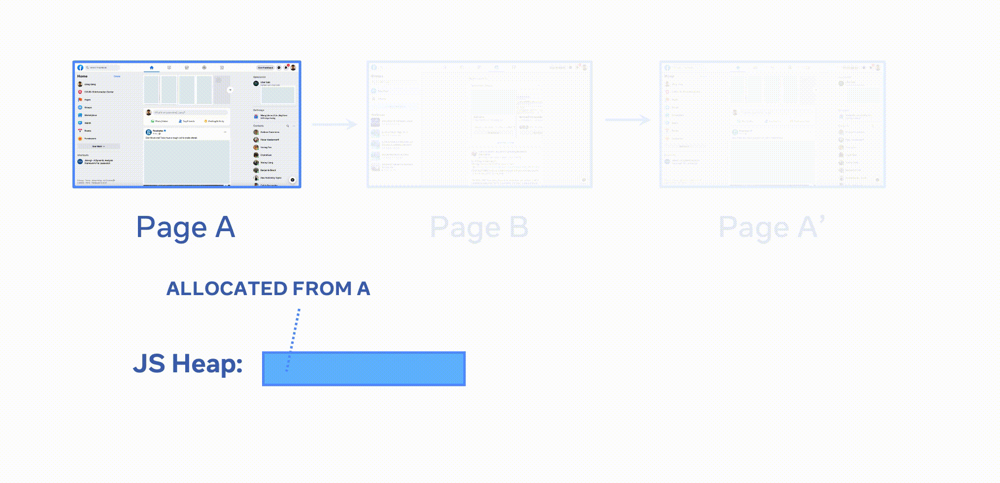
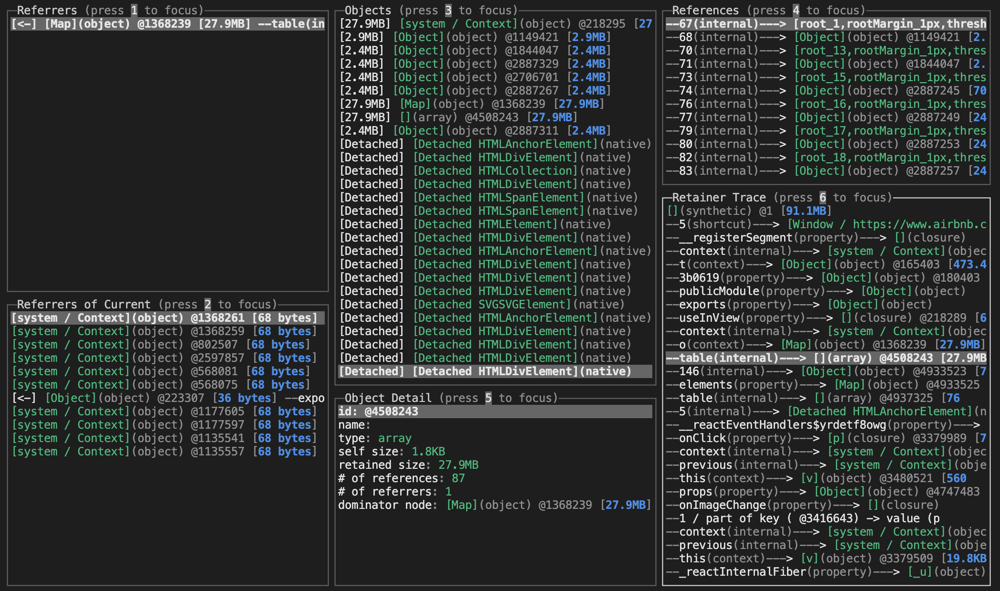
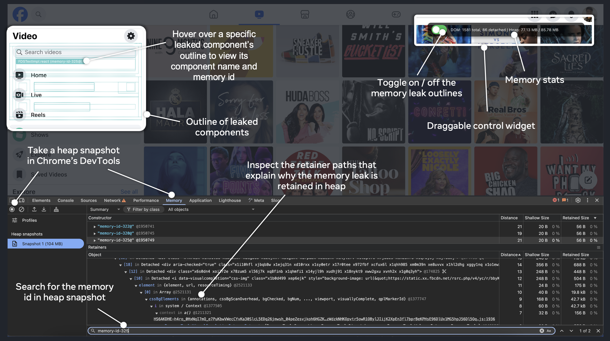

<h1 align="center">
  <a href="https://facebook.github.io/memlab/">MemLab</a>
</h1>

<p align="center">
  <a href="https://github.com/facebook/memlab/blob/master/LICENSE">
    
  </a>
  <a href="https://github.com/facebook/memlab/blob/main/CONTRIBUTING.md">
    
  </a>
  <a href="https://www.npmjs.com/package/memlab?activeTab=readme">
    
  </a>
</p>

memlab is an end-to-end testing and analysis framework for identifying
JavaScript memory leaks and optimization opportunities.

**Online Resources:** [[Website and Demo](https://facebook.github.io/memlab)] | [[Documentation](https://facebook.github.io/memlab/docs/intro)] | [[Meta Engineering Blog Post](https://engineering.fb.com/2022/09/12/open-source/memlab/)] | [[AI Assistant Guide](./AI.md)]

Features:

- **Browser memory leak detection** - Write test scenarios with the Puppeteer
  API, and memlab will automatically compare JavaScript heap snapshots, filter
  out memory leaks, and aggregate the results
- **Object-oriented heap traversal API** - Supports the creation of
  custom memory leak detectors, and enables programmatic analysis of JS heap
  snapshots taken from Chromium-based browsers, Node.js, Electron.js, and Hermes
- **Memory CLI toolbox** - Built-in toolbox and APIs for finding memory
  optimization opportunities (not necessarily just memory leaks)
- **MemLens: Browser Memory Debugging Tools** - Enables visualization of memory
  leaks and interactive memory debugging in the browser.
- **Memory assertions in Node.js** - Enables unit tests or running node.js
  programs to take a heap snapshot of their own state, perform self memory
  checking, or write advanced memory assertions
- **MCP server for AI coding assistants** - Provides an MCP server that gives
  AI coding assistants (Claude Code, Cursor, etc.) interactive tools to load
  heap snapshots, find memory leaks, and investigate optimization opportunities
  through natural language conversation



## CLI Usage

Install the CLI

```bash
npm install -g memlab
```

### Find Memory Leaks

To find memory leaks in Google Maps, you can create a
[scenario file](https://facebook.github.io/memlab/docs/api/core/src/interfaces/IScenario) defining how
to interact with Google Maps. Let's call it `test-google-maps.js`:

```javascript
// initial page load url: Google Maps
function url() {
  return 'https://www.google.com/maps/@37.386427,-122.0428214,11z';
}

// action where we want to detect memory leaks: click the Hotels button
async function action(page) {
  // puppeteer page API
  await page.click('text/Hotels');
}

// action where we want to go back to the step before: click clear search
async function back(page) {
  // puppeteer page API
  await page.click('[aria-label="Close"]');
}

module.exports = {action, back, url};
```

Now run memlab with the scenario file, memlab will interact with
the web page and detect memory leaks with built-in leak detectors:

```bash
memlab run --scenario test-google-maps.js
```

memlab will print memory leak results showing one representative
retainer trace for each cluster of leaked objects.

**Retainer traces**: This is the result from
[an example website](https://facebook.github.io/memlab/docs/guides/guides-find-leaks),
the retainer trace is an object reference chain from the GC root to a leaked
object. The trace shows why and how a leaked object is still kept alive in
memory. Breaking the reference chain means the leaked object will no longer
be reachable from the GC root, and therefore can be garbage collected.
By following the leak trace one step at a time, you will be able to find
a reference that should be set to null (but it wasn't due to a bug).

```bash
MemLab found 46 leak(s)
--Similar leaks in this run: 4--
--Retained size of leaked objects: 8.3MB--
[Window] (native) @35847 [8.3MB]
  --20 (element)--->  [InternalNode] (native) @130981728 [8.3MB]
  --8 (element)--->  [InternalNode] (native) @130980288 [8.3MB]
  --1 (element)--->  [EventListener] (native) @131009888 [8.3MB]
  --1 (element)--->  [V8EventListener] (native) @224808192 [8.3MB]
  --1 (element)--->  [eventHandler] (closure) @168079 [8.3MB]
  --context (internal)--->  [<function scope>] (object) @181905 [8.3MB]
  --bigArray (variable)--->  [Array] (object) @182925 [8.3MB]
  --elements (internal)--->  [(object elements)] (array) @182929 [8.3MB]
...
```

To get a readable trace, the website under test needs to serve non-minified code (or at least minified code
with readable variable, function, and property names on objects).

Alternatively, you can debug the leak by loading the heap snapshot taken by memlab (saved in `$(memlab get-default-work-dir)/data/cur`)
in Chrome DevTool and search for the leaked object ID (`@182929`).

**View Retainer Trace Interactively**

View memory issues detected by memlab based on a single JavaScript
heap snapshot taken from Chromium, Hermes, memlab, or any node.js
or Electron.js program:

```bash
memlab view-heap --snapshot <PATH TO .heapsnapshot FILE>
```

You can optionally specify a specific heap object with the object's id: `--node-id @28173` to pinpoint a specific object.



**Custom leak detector**: If you want to use a custom leak detector, add a `leakFilter` callback
([doc](https://facebook.github.io/memlab/docs/api/core/src/interfaces/IScenario/#leakfilter))
in the scenario file. `leakFilter` will be called for every unreleased heap
object (`node`) allocated by the target interaction.

```javascript
function leakFilter(node, heap) {
  // ... your leak detector logic
  // return true to mark the node as a memory leak
}
```

`heap` is the graph representation of the final JavaScript heap snapshot.
For more details, view the
[doc site](https://facebook.github.io/memlab/docs/api/core/src/interfaces/IHeapSnapshot).

### Heap Analysis and Investigation

View which object keeps growing in size during interaction in the previous run:

```bash
memlab analyze unbound-object
```

Analyze pre-fetched V8/hermes `.heapsnapshot` files:

```bash
memlab analyze unbound-object --snapshot-dir <DIR_OF_SNAPSHOT_FILES>
```

Use `memlab analyze` to view all built-in memory analyses.
For extension, view the [doc site](https://facebook.github.io/memlab).

View retainer trace of a particular object:

```bash
memlab trace --node-id <HEAP_OBJECT_ID>
```

Use `memlab help` to view all CLI commands.

## APIs

Use the `memlab` npm package to start an E2E run in the browser and detect memory leaks.

```javascript
const memlab = require('memlab');

const scenario = {
  // initial page load url
  url: () => 'https://www.google.com/maps/@37.386427,-122.0428214,11z',

  // action where we want to detect memory leaks
  action: async page => await page.click('text/Hotels'),

  // action where we want to go back to the step before
  back: async page => await page.click('[aria-label="Close"]'),
};
memlab.run({scenario});
```

## MCP Server for AI Coding Assistants

The [`@memlab/mcp-server`](./packages/mcp-server) package provides an
[MCP (Model Context Protocol)](https://modelcontextprotocol.io/) server that
wraps MemLab's heap analysis APIs, giving AI coding assistants (Claude Code,
Cursor, Windsurf, etc.) interactive tools to explore JavaScript heap snapshots,
find memory leaks, and identify optimization opportunities — all through
natural language conversation.

### Setup

Install globally and add to your MCP config (`~/.claude.json` for Claude Code,
or `.mcp.json` for Cursor/Windsurf):

```bash
npm install -g @memlab/mcp-server
```

```json
{
  "mcpServers": {
    "memlab": {
      "type": "stdio",
      "command": "memlab-mcp",
      "env": {
        "NODE_OPTIONS": "--max-old-space-size=8192"
      }
    }
  }
}
```

Or use npx without installing:

```json
{
  "mcpServers": {
    "memlab": {
      "type": "stdio",
      "command": "npx",
      "args": ["@memlab/mcp-server"],
      "env": {
        "NODE_OPTIONS": "--max-old-space-size=8192"
      }
    }
  }
}
```

### Available Tools

Once connected, the MCP server exposes tools for heap snapshot analysis
including: loading snapshots, viewing summaries, finding the largest objects
by retained size, looking up retainer traces, detecting detached DOM nodes,
inspecting closures, searching nodes by class/property/pattern, analyzing
duplicated strings, and more. See the
[`@memlab/mcp-server` README](./packages/mcp-server/README.md) for the full
tool reference and example workflows.

## Visual Debugging for Memory Leaks in Browser

Please check out this [tutorial page](https://facebook.github.io/memlab/docs/guides/visually-debug-memory-leaks-with-memlens)
on how to use MemLens (a debugging utility) to
visualize memory leaks in the browser for easier memory debugging.



## Memory Assertions

memlab makes it possible for a unit test or running Node.js program
to take a heap snapshot of its own state and write advanced memory assertions:

```typescript
// save as example.test.ts
import type {IHeapSnapshot, Nullable} from '@memlab/core';
import {config, takeNodeMinimalHeap} from '@memlab/core';

class TestObject {
  public arr1 = [1, 2, 3];
  public arr2 = ['1', '2', '3'];
}

test('memory test with heap assertion', async () => {
  config.muteConsole = true; // no console output

  let obj: Nullable<TestObject> = new TestObject();
  // get a heap snapshot of the current program state
  let heap: IHeapSnapshot = await takeNodeMinimalHeap();

  // call some function that may add references to obj
  rabbitHole(obj);

  expect(heap.hasObjectWithClassName('TestObject')).toBe(true);
  obj = null;

  heap = await takeNodeMinimalHeap();
  // if rabbitHole does not have any side effect that
  // adds new references to obj, then obj can be GCed
  expect(heap.hasObjectWithClassName('TestObject')).toBe(false);
}, 30000);
```

For other APIs check out the
[API documentation](https://facebook.github.io/memlab/docs/api/core/src/interfaces/IHeapSnapshot#hasobjectwithclassname).

## AI Assistant Guide

The [`AI.md`](./AI.md) file provides structured guidance for AI coding
assistants (Claude Code, Cursor, GitHub Copilot, ChatGPT, etc.) working with
MemLab. It covers:

- **Creating test scenarios** — how to write MemLab scenario files using the
  `IScenario` interface, correct Puppeteer Page API usage, and common pitfalls
  to avoid
- **Interpreting retainer traces** — how to read the reference chain from GC
  root to a leaked object and identify which reference to break
- **Using heap analysis plugins** — the built-in analysis plugins available via
  `memlab analyze` and how to use the programmatic API
- **MCP server tools** — how AI assistants can use the `@memlab/mcp-server` to
  interactively load, query, and analyze heap snapshots

## Development

Use node version 16 or above. To build on Windows, please use Git Bash.

First build the project as follows:

```bash
npm install
npm run build
```

Then keep this helper script running to ensure that local changes are picked up
and compiled automatically during development:

```bash
npm run dev
```

NOTE: To run the memlab cli locally, make sure to prefix the memlab command with
npx from within the memlab repo e.g. `npx memlab`

Run tests:

```bash
npm run test
```

## License

memlab is MIT licensed, as found in the [LICENSE](LICENSE) file.

## Contributing

Check our [contributing guide](CONTRIBUTING.md) to learn how to
contribute to the project.

## Code of Conduct

Check our [Code of Conduct](CODE_OF_CONDUCT.md) to learn more about our
contributor standards and expectations.
