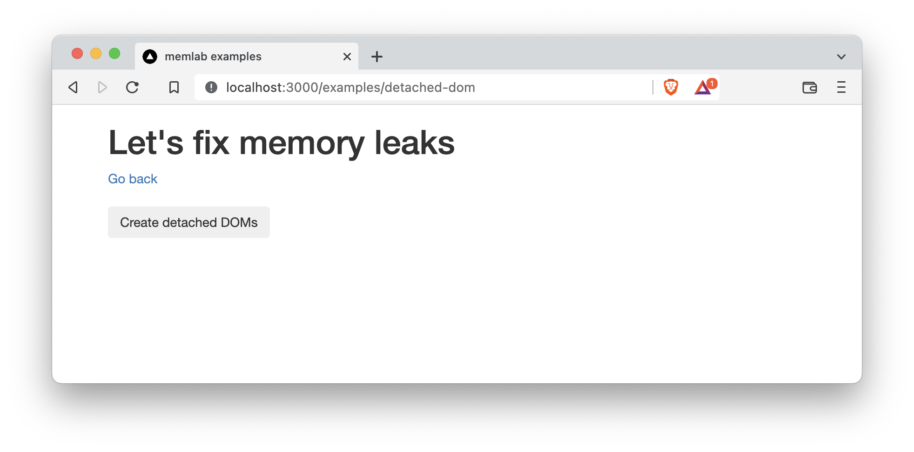

import CodeBlock from '@theme/CodeBlock';
import DetachedDomScenario from '!!raw-loader!../../../packages/e2e/static/example/scenarios/detached-dom.js';
import DetachedDomPage from '!!raw-loader!../../../packages/e2e/static/example/pages/examples/detached-dom.jsx';

# Detect Leaks in a Demo App

This is a tutorial demonstrating how to detect detached DOM elements with memlab.

## Set up the Example Web App Under Test

The demo app leaks detached DOM elements when you click the
"Create detached DOMs" button.
Each click creates 1024 detached DOM elements, which are referenced
by the `window` object.



<CodeBlock showLineNumbers language="jsx">{DetachedDomPage}</CodeBlock>

Source file: [`packages/e2e/static/example/pages/examples/detached-dom.jsx`](../../../packages/e2e/static/example/pages/examples/detached-dom.jsx)

### 1. Clone Repo

To run the demo web app on you local machine, clone the
[`memlab` github repo](https://github.com/facebookincubator/memlab):
```bash
git clone git@github.com:facebookincubator/memlab.git
```

### 2. Run the Example App
Once you have a repo in your local machine, run the following commands
from the root directory of memlab project:

```bash
npm install && npm run build
cd packages/e2e/static/example
npm install && npm run dev
```

This will spin up an example Nextjs app. Let's make sure it is
running by visiting from your browser
[http://localhost:3000](http://localhost:3000):

:::note
The port number `:3000` may be different in your case.
:::

## Find Memory Leaks

### 1. Create a Scenario File

<CodeBlock language="jsx">{DetachedDomScenario}</CodeBlock>

Let's save this file at `~/memlab/scenarios/detached-dom.js`.

### 2. Run memlab

This may take about a few minutes:

```bash
memlab run --scenario ~/memlab/scenarios/detached-dom.js
```

### 3. Debug Leak Trace

For each leaked object group, memLab prints one representative leak trace.


Let's break down the results from the top to bottom:

**Part-1**: Browser interaction breadcrumb shows the browser
interactions (navigations) `memlab` performed as specified in our scenario file.

  * **`page-load[6.5MB](baseline)[s1]`** - the JavaScript heap size was
    `6.5MB` on initial page load. The `baseline` heap snapshot will be saved as
    `s1.heapsnapshot` on disk.
  * **`action-on-page[6.6MB](baseline)[s2]`** - After clicking the
    "Create detached DOMs" button, the heap size increased to `6.6MB`.
  * **`revert[7MB](final)[s3]`** - The web page finally reached 7MB
    after navigating away from the page that triggered the memory leak.

**Part-2**: Overall summary of the leak trace

  * **`1024 leaks`** - There were 1024 leaked objects.
    Line 12 of the [example app](docs/guides/guides-detached-dom#example-web-app-under-test)
    created **1024** detached DOM objects in the `for` loop.
  * **`Retained size`** - the aggregated retained sizes of the leaked objects
    cluster is `143.3KB` (memory leaks are grouped together based on the
    similarity of retainer traces).

**Part-3**: Detailed representative *leak trace* for each leak cluster

:::note
A *leak trace* is an object reference chain from the GC root (the entry objects in a heap graph from which garbage collectors traverse the heap) to a leaked object.
The trace shows why and how a leaked object is still kept alive in memory.
Breaking the reference chain means the leaked object will no longer be reachable
from the GC root, and therefore can be garbage collected.

By following the leak trace one step at a time from the native Window (i.e. the GC root) downward, you will be able to find a
reference that should be set to `null` (but it wasn't due to a bug).
:::
  * `map` - This is the V8 HiddenClass (V8 uses this internally to store meta information about the shape of an object and a reference to its prototype - see more [here](https://v8.dev/blog/fast-properties#hiddenclasses-and-descriptorarrays)) of the object being accessed - for the most part this is a V8 implementation detail and can be ignored.
  * `prototype` - This is the instance of the `Window` class.
  * `leakedObjects` - This shows that `leakedObjects` was a property of the
    `Window` object with size `148.5KB` pointing to an `Array` object.
  * `0` - This shows that a detached `HTMLDIVElement` (i.e. a DOM element that is not currently connected to the DOM tree) is stored as the first element of the `leakedObjects` array (Since it is overwhelming to show all 1024 leak traces,
    `memlab` only prints one representative leak trace. i.e. property 0 instead of properties 0->1023)
    
    In short, the leak trace path from `window` object to leaked object is:
```
[window](object) -> leakedObjects(property) -> [Array](object)
  -> 0(element) -> [Detached HTMLDIVElement](native)
```

which matches the leaking code in the example: 

```javascript
window.leakedObjects = [];
for (let i = 0; i < 1024; i++) {
    window.leakedObjects.push(document.createElement('div'));
}
```
