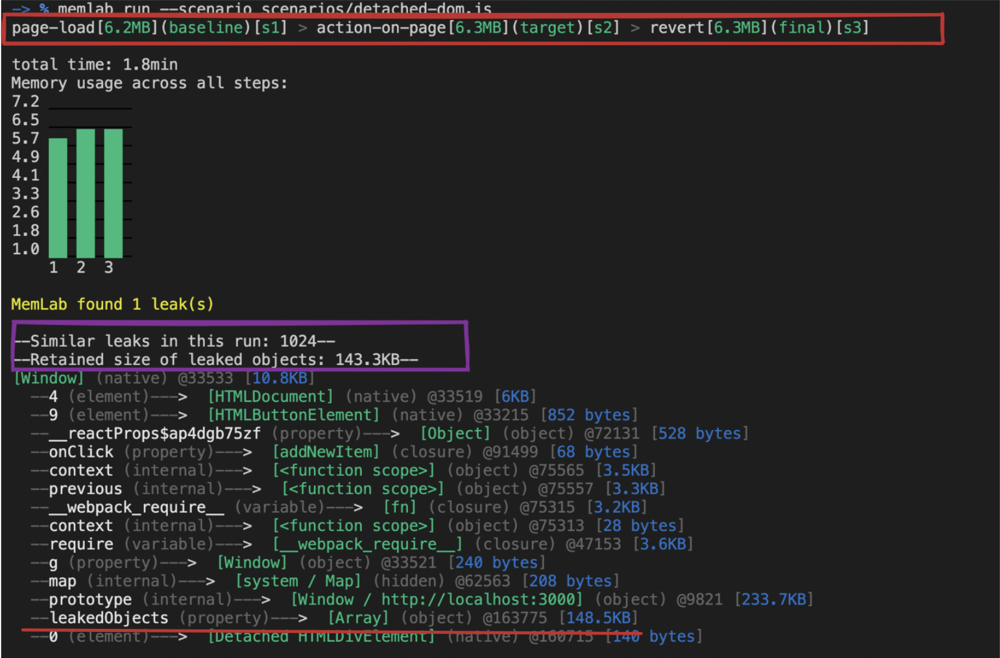

import CodeBlock from '@theme/CodeBlock';
import DetachedDomScenario from '!!raw-loader!../../../packages/e2e/static/example/scenarios/detached-dom.js';
import DetachedDomPage from '!!raw-loader!../../../packages/e2e/static/example/pages/examples/detached-dom.jsx';

# Detached DOM

We will be running the `memlab` against the following sample page which creates detached DOM elements when you click button "Create detached DOMs".
Every click we will create `1024` detached DOM elements and keep the reference in the window object.
## Example Web App under Test
This is file is located at `packages/e2e/static/example/pages/examples/detached-dom.jsx`
<CodeBlock showLineNumbers language="jsx">{DetachedDomPage}</CodeBlock>

## 1. Clone Repo

Let's make sure the example app is running on your local machine. If you haven't cloned the project, please go ahead and clone the repo at [memlab repo](https://github.com/facebookincubator/memlab).

## 2. Run the Example App
Once you have a repo in your local machine, run the following:

```bash
# from the root directory of memlab project
yarn build
cd packages/e2e/static/example
yarn && yarn dev
```

This will spin up the example Nextjs app. Let's make sure it is running by hitting it from the browser [http://localhost:3000](http://localhost:3000).
:::note
The port number `:3000` may be different in your case.
:::
## 3. Define a Scenario File
<CodeBlock language="jsx">{DetachedDomScenario}</CodeBlock>

Let's save this file at `~/memlab/scenarios/detached-dom.js`.

## 4. Run memlab
This will take about a few minutes.
```bash
memlab run --scenario ~/memlab/scenarios/detached-dom.js
```

The result will look like this.

Let's break down the result from the top to down.
- Red rectangle shows that actions (navigations) `memlab` took as specified in our scenario file.
    - **page-load\[6.2MB\]\(baseline\)[s1]** - the heap size was `6.2MB` on initial load. After clicking the *Create detached DOMs* button, the heap was increased to `6.3MB` and it stayed the same after navigating away.
- Overall summary of the leak trace.
    - **1024 leaks** - it shows that there were 1024 leaks. You can see at line `12` that we are creating **1024** detached DOM objects in for loop.
    - **Retained size** - the total size of leaked objects is `143.3KB`.
- **leakedObjects** - this shows that leakedObjects were a property of `Window` object with size `148.5KB` pointing to an `Array` object. Since it is not possible to show all 1024 leak traces in the result, `memlab` only shows one represantative leak trace.
In short, the leak trace path from `window` object to leaked object is:
> ```[window](object) -> leakedObjects(property) -> [Array](object) -> 0(element) -> [Detached HTMLDIVElement](native)```
