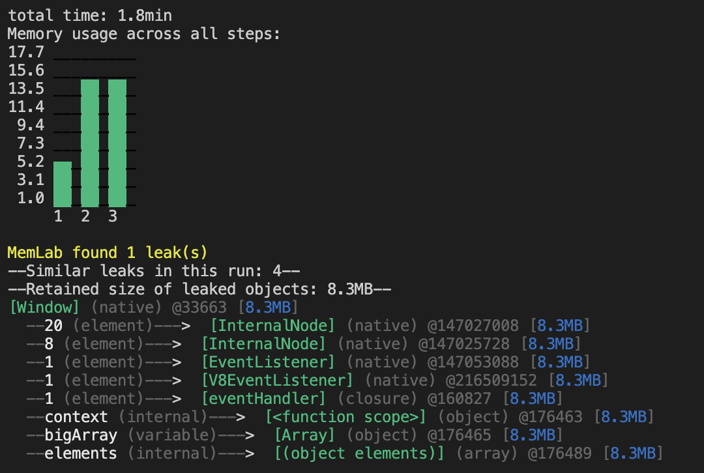

import CodeBlock from '@theme/CodeBlock';
import OversizedFilter from '!!raw-loader!../../../packages/e2e/static/example/scenarios/oversized-leak-filter.js';
import OversizedScenario from '!!raw-loader!../../../packages/e2e/static/example/scenarios/oversized-object.js';
import OversizedScenarioWithFilter from '!!raw-loader!../../../packages/e2e/static/example/scenarios/oversized-object-with-filter.js';
import oversizedObjectExample from '!!raw-loader!../../../packages/e2e/static/example/pages/examples/oversized-object.jsx';

# Detect Oversized Object

This is a tutorial demonstrating how to detect oversized objects that are not
released by a web app.

We recommend reading
[Detect Leaks in a Demo App](guides-detached-dom), which will walk you through
how to interpret memlab results and debug leak traces.

## Set up the Example Web App Under Test

The demo app leaks a big array in each React rendering call (through the
unregistered event handler and the closure scope chain).

<CodeBlock showLineNumbers language="jsx">{oversizedObjectExample}</CodeBlock>

Source file: [packages/e2e/static/example/pages/examples/oversized-object.jsx](../../../packages/e2e/static/example/pages/examples/oversized-object.jsx)

### 1. Clone Repo

To run the demo web app on you local machine, clone the
[`memlab` github repo](https://github.com/facebookincubator/memlab):
```bash
git clone git@github.com:facebookincubator/memlab.git
```

### 2. Run the Example App
Once you have a repo in your local machine, run the following commands
from the root directory of memlab project:

```bash
npm install && npm run build
cd packages/e2e/static/example
npm install && npm run dev
```

This will spin up an example Nextjs app. Let's make sure it is
running by visiting from your browser [http://localhost:3000](http://localhost:3000):

:::note
The port number `:3000` may be different in your case.
:::

## First Attempt to Find Leaks

### 1. Create a Scenario File
<CodeBlock language="jsx" showLineNumbers>{OversizedScenario}</CodeBlock>

Let's save this file as `~/memlab/scenarios/oversized-object.js`.

### 2. Run memlab
This will take a few minutes.
```bash
memlab run --scenario ~/memlab/scenarios/oversized-object.js
```
This time `memlab` didn't find any memory leaks.

The current built-in Leak detector only considers objects
that meets all of the following criterion as memory leaks:
 * The object is allocated by interaction triggered by the `action` callback.
 * The object is not released after the interaction triggered by the `back` callback.
 * The object is a detached DOM element or an unmounted React Fiber node.

The other objects allocated by the `action` callback could be caches retained
by the web app on purpose.

## Filter Out Large Objects

One rule we often find useful is to check unreleased object with
non-trivial sizes (for example 1MB).

memlab provides an additional `leakFilter` callback to filter
out leaked objects with self-defined rules.

<CodeBlock language="jsx" showLineNumbers>{OversizedScenarioWithFilter}</CodeBlock>

Now let's rerun memlab with the updated scenario file:

```bash
memlab run --scenario ~/memlab/scenarios/oversized-object.js
```



An alternetive is creating a `leak-filter.js` and pass it to `memlab find-leaks`
if you have run `memlab run` already.

<CodeBlock language="jsx" showLineNumbers>{OversizedFilter}</CodeBlock>

Break out the `leakFilter` function and save it in a file,
for example, `~/memlab/leak-filters/leak-filter-by-retained-size.js`

```bash
memlab find-leaks --leak-filter ~/memlab/leak-filters/leak-filter-by-retained-size.js
```

If you need more advanced filtering logic, here are [more examples](https://github.com/facebookincubator/memlab/tree/main/packages/cli/src/options/heap/leak-filter/examples/).
