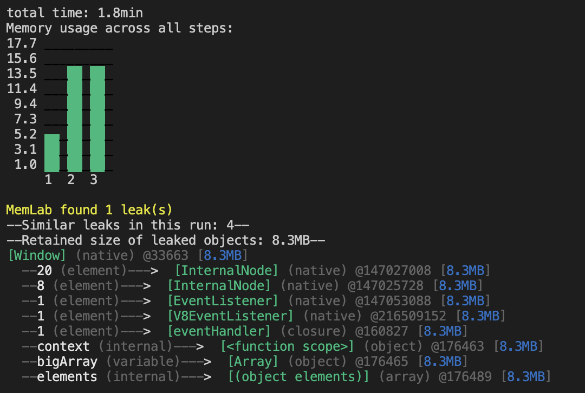

import CodeBlock from '@theme/CodeBlock';
import OversizedFilter from '!!raw-loader!../../../packages/e2e/static/example/scenarios/oversized-leak-filter.js';
import OversizedScenario from '!!raw-loader!../../../packages/e2e/static/example/scenarios/oversized-object.js';
import OversizedScenarioWithFilter from '!!raw-loader!../../../packages/e2e/static/example/scenarios/oversized-object-with-filter.js';
import oversizedObjectExample from '!!raw-loader!../../../packages/e2e/static/example/pages/examples/oversized-object.jsx';

# Detect Oversized Object

This is a tutorial demonstrating how to detect oversized objects that are not
released by a web app.

We recommend reading
[Detect Leaks in a Demo App](./01-detached-dom.mdx), which will walk you through
how to interpret memlab results and debug leak traces.

## Set up the Example Web App Under Test

The demo app leaks a big array in each React rendering call (through the
unregistered event handler and the closure scope chain).

<CodeBlock showLineNumbers language="jsx">{oversizedObjectExample}</CodeBlock>

Source file: [packages/e2e/static/example/pages/examples/oversized-object.jsx](../../../packages/e2e/static/example/pages/examples/oversized-object.jsx)

### 1. Clone Repo

To run the demo web app on your local machine, clone the
[`memlab` github repo](https://github.com/facebook/memlab):
```bash
git clone git@github.com:facebook/memlab.git
```

### 2. Run the Example App
Once you have cloned the repo on your local machine, run the following commands
from the root directory of the `memlab` project:

```bash
npm install && npm run build
cd packages/e2e/static/example
npm install && npm run dev
```

This will start an example Next.js app. Verify that it is
running by visiting [http://localhost:3000](http://localhost:3000)
in your browser:

:::note
The port number `:3000` may be different in your case.
:::

## First Attempt to Find Leaks

### 1. Create a Scenario File
<CodeBlock language="jsx" showLineNumbers>{OversizedScenario}</CodeBlock>

Let's save this file as `~/memlab/scenarios/oversized-object.js`.

### 2. Run memlab
This will take a few minutes.
```bash
memlab run --scenario ~/memlab/scenarios/oversized-object.js
```
This time memlab didn't find any memory leaks.

The built-in leak detector only considers objects
that meet all of the following criteria as memory leaks:
 * The object was allocated by the interaction triggered by the `action` callback.
 * The object was not released after the interaction triggered by the `back` callback.
 * The object is a detached DOM element or an unmounted React Fiber node.

Other objects allocated by the `action` callback may be caches that the
web app retains intentionally, so by default memlab does not report them as leaks.

## Filter Out Large Objects

A useful rule of thumb is to check for unreleased objects above
a certain size threshold (for example, 1MB).

memlab provides an additional `leakFilter` callback to filter
out leaked objects with self-defined rules.

<CodeBlock language="jsx" showLineNumbers>{OversizedScenarioWithFilter}</CodeBlock>

Now let's rerun memlab with the updated scenario file:

```bash
memlab run --scenario ~/memlab/scenarios/oversized-object.js
```



By examining the leak trace, we can see that the `elements` in `bigArray` are
being retained because `bigArray` is captured by the `eventHandler`
closure, which in turn is retained because it is still registered as the handler
for an `EventListener`. If you add a cleanup function to the `useEffect`
as shown below and run the scenario again, memlab will no longer report
any leaks.

```javascript
useEffect(() => {
  window.addEventListener('custom-click', eventHandler);
  return () => {
    // clean up
    window.removeEventListener('custom-click', eventHandler);
  };
}, []);
```

:::note
Alternatively, if you have already run `memlab run`, you can create a
`leak-filter.js` file and pass it to `memlab find-leaks`.
:::

<CodeBlock language="jsx" showLineNumbers>{OversizedFilter}</CodeBlock>

Extract the `leakFilter` function into its own file,
for example `~/memlab/leak-filters/leak-filter-by-retained-size.js`:

```bash
memlab find-leaks --leak-filter ~/memlab/leak-filters/leak-filter-by-retained-size.js
```

If you need more advanced filtering logic, here are
[more examples](https://github.com/facebook/memlab/tree/main/packages/cli/src/options/heap/leak-filter/examples/).
